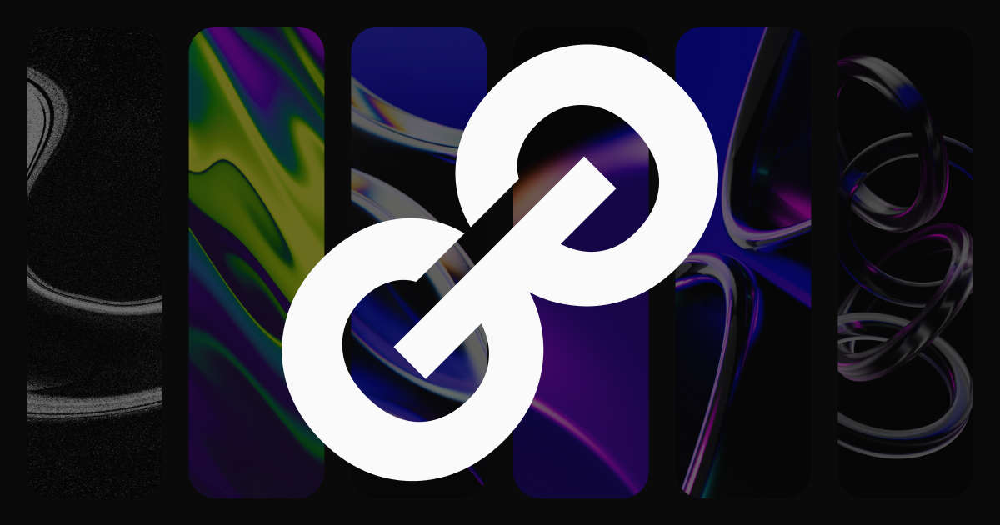

<div align="center">
  

  <h1>Portfolio</h1>

  <p>Turning ideas into reality!</p>

<a href="https://luisgrizzo.dev" target="_blank">Go to site</a>

</div>

---

## 🛠️ Stack

- [React.js](https://react.dev/)
- [Next.js](https://nextjs.org/)
- [Tailwindcss](https://tailwindcss.com/)
- [Framer Motion](https://www.framer.com/motion/)
- [Jest](https://jestjs.io/)
- [Testing Library React](https://testing-library.com/)

## 💭 Motivation

I developed this project with the purpose of having a central hub to present my projects developed and published on my Github, in addition to making my main social networks available for contact.

## ✅ Prerequisites

Make sure you have [Node.js](https://nodejs.org/) and [NPM](https://www.npmjs.com/) installed.

## 💻 Run project

1. Clone repository:

   ```sh
   git clone https://github.com/luis-grizzo/portfolio.git
   ```

2. go to project directory:

   ```sh
   cd portfolio
   ```

3. Install dependencies:

   ```sh
   npm install
   ```

4. Run development server:
   ```sh
   npm run dev
   ```

## :memo: License

This project is under the MIT license. See [LICENSE](https://github.com/luis-grizzo/portfolio/blob/main/LICENSE) for more information.

---

👨‍🦱 Developed by **Luís Grizzo** - **Contact:** <a href="https://www.linkedin.com/in/luis-grizzo/">Linkedin</a>
